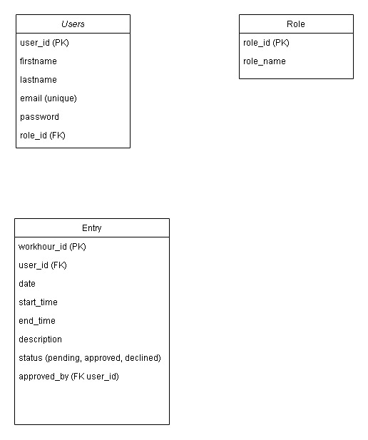

# Hourbook
Hourbook - Work Hour Management System

## About the project
This application is designed to help employers and employees track and manage work hours efficiently. It consists of a Java Spring Boot back-end that handles business logic, database interactions, and APIs, paired with a React front-end for a user-friendly interface. The system aims to streamline time tracking and reporting. 

## Use cases
### Approve Work Hours

Actors: Employer

Description: Employers can review and approve work hours submitted by employees.

Preconditions:

* Employers are logged in.
Postconditions:
* Work hours are marked as approved or rejected.
Basic Flow:

1. Employer navigates to the "Pending Work Hours" page.
2. Reviews submitted hours by employees.
3. Approves or rejects the submission with optional comments.
4. System updates the status in the database.

Alternate Flows:

* Employers can filter by employee, date, or project for faster review.

### Edit Work Hours

Actors: Employee

Description: Employees can edit work hour entries that have not yet been approved.

Preconditions:

* Employees are logged in.
* The entry status is "Pending."

Postconditions:

* System updates the entry with the new details.

Basic Flow:

1. Employee navigates to the "My Work Hours" page.
2. Selects an entry with "Pending" status.
3. Updates the relevant fields.
4. Saves the changes.
5. System validates and updates the entry in the database.

## User stories

-I want to be able to add my work hours for the day *Restaurant worker 32

-I need to see my worked hours as a list *Construction worker 24

-I would like to see if my employer has approved my hours *Painter 19

-I would like to see a list of my employees hours *Construction Company Owner 41

-I need to be able to approve my workers worked hours *Manager 37

-I want to comment on my employees worked hours *Manager 54

## Database

## Team Members
- Vilho Karhu https://github.com/kvilho
- Julius Luhtala https://github.com/juliusluhtala
- Nikolas Kataja https://github.com/bhi049
- Kasperi Kuusanmäki https://github.com/kapseri
- Ville Kotilainen https://github.com/villekotilainen

## Backlog Link
https://app.clickup.com/9012737518/v/l/8ck6xfe-732
