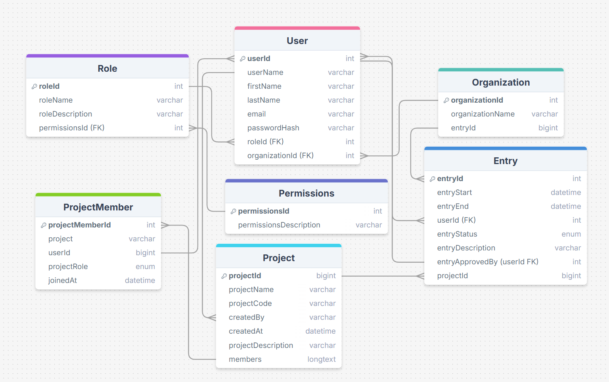

# nowhitespaces

[](https://github.com/kvilho/nowhitespaces/actions/workflows/backend.yml)
[](https://github.com/kvilho/nowhitespaces/actions/workflows/frontend.yml)

# Hourbook

<p align="center">
  
</p>

Hourbook - Work Hour Management System

## About the project
This application is designed to help employers and employees track and manage work hours efficiently. It consists of a Java Spring Boot back-end that handles business logic, database interactions, and APIs, paired with a React front-end for a user-friendly interface. The system aims to streamline time tracking and reporting. 

## Use cases
### Approve Work Hours

Actors: Employer

Description: Employers can review and approve work hours submitted by employees.

Preconditions:

* Employers are logged in.
Postconditions:
* Work hours are marked as approved or rejected.
Basic Flow:

1. Employer navigates to the "Pending Work Hours" page.
2. Reviews submitted hours by employees.
3. Approves or rejects the submission with optional comments.
4. System updates the status in the database.

Alternate Flows:

* Employers can filter by employee, date, or project for faster review.

### Edit Work Hours

Actors: Employee

Description: Employees can edit work hour entries that have not yet been approved.

Preconditions:

* Employees are logged in.
* The entry status is "Pending."

Postconditions:

* System updates the entry with the new details.

Basic Flow:

1. Employee navigates to the "My Work Hours" page.
2. Selects an entry with "Pending" status.
3. Updates the relevant fields.
4. Saves the changes.
5. System validates and updates the entry in the database.

## Database



## 🚀 Deployment

The application consists of a Spring Boot backend and a Vite-based frontend.

### 🛠 Backend (Spring Boot)

✅ Deployed and running at:

🔗 [https://hourbook-hourbook.2.rahtiapp.fi/](https://hourbook-hourbook.2.rahtiapp.fi/)

The backend provides the core REST API used by the application.  
See [📚 REST API Documentation](#-rest-api-documentation) for available endpoints and usage.

### 🎨 Frontend (Vite)

✅ Deployed and running at:

🔗 [https://hourbook-frontend-hourbook.2.rahtiapp.fi/](https://hourbook-frontend-hourbook.2.rahtiapp.fi/)

## 📘 Project Documentation

### 🛠 Technologies Used

#### Frontend
- **Language:** TypeScript
- **Framework:** React (with Vite)
- **Key Libraries:**
  - `react-router-dom` – Client-side routing
  - `@mui/material` – Material UI component library
  - `@emotion/react`, `@emotion/styled` – Styling support
  - `date-fns` – Date utility library
  - `react-big-calendar` – Calendar and scheduling
  - `axios` – HTTP client for API requests
  - `recharts` – Data visualization library
- **Build Tool:** Vite
- **Styling:** CSS Modules and custom stylesheets (e.g., `navbar.css`, `projects.css`, `calendar.css`)

#### Backend
- **Language:** Java
- **Framework:** Spring Boot
- **Key Frameworks/Libraries:**
  - `Spring Security` – Authentication and authorization (with JWT support)
  - `Spring Data JPA` – ORM and database operations
  - `Swagger/OpenAPI` – API documentation
  - `JUnit` and `Mockito` – Testing
- **Database:** PostgreSQL

---

## 📁 Project Structure

## 📁 Frontend (React + TypeScript)

The frontend is implemented using **React** with **TypeScript** and **Vite** for fast development. It provides a user-friendly interface for managing projects and tracking work hours.

### Key Directories and Files

- **`src/`**
  - **`components/`**: Reusable UI components.
    - `ManageProjectDialog.tsx`: Dialog for managing project details.
    - `ProjectActions.tsx`: Component for project-related actions (e.g., create, join).
  - **`pages/`**: Page-level components for routing.
    - `Projects.tsx`: Displays a list of projects.
    - `ProjectDetails.tsx`: Displays details of a specific project.
  - **`services/`**: API service classes for interacting with the backend.
    - `projectService.ts`: Handles API calls related to projects.
  - **`styles/`**: CSS files for styling.
    - `projects.css`: Styles for project-related pages.
    - `projectDetails.css`: Styles for the project details page.
    - `calendar.css`: Styles for calendar components.

- **`public/`**
  - Static assets such as images and icons.

- **`package.json`**
  - Defines project dependencies and scripts.
    - `npm run dev`: Starts the development server.
    - `npm run build`: Builds the production-ready app.

---

## 📁 Backend (Spring Boot)

The backend is implemented using **Java** with the **Spring Boot** framework. It handles business logic, database interactions, and provides RESTful APIs for the frontend.

### Key Directories and Files

- **`src/main/java/fi/haagahelia/backend`**
  - **`controllers/`**: Contains REST controllers for handling HTTP requests.
    - `ProjectController.java`: Manages project-related endpoints (e.g., create, update, delete projects).
    - `OrganizationRestController.java`: Handles organization-related endpoints.
  - **`dto/`**: Data Transfer Objects for encapsulating data.
    - `HourSummaryDTO.java`: DTO for summarizing hour data.
  - **`model/`**: Entity classes representing database tables.
    - `Project.java`: Represents a project entity.
    - `ProjectMember.java`: Represents a project member entity.
    - `ProjectRole.java`: Enum for project roles (e.g., OWNER, EMPLOYEE).
    - `User.java`: Represents a user entity.
  - **`repositories/`**: Interfaces for database operations.
    - `ProjectRepository.java`: Handles CRUD operations for projects.
    - `ProjectMemberRepository.java`: Handles operations for project members.
  - **`services/`**: Contains business logic.
    - `ProjectService.java`: Core service for managing projects.
    - `HourSummaryService.java`: Service for summarizing hour data.
  - **`BackendApplication.java`**: Main entry point for the Spring Boot application.

- **`src/main/resources`**
  - **`db/migration/`**: Database migration scripts.
    - `V2__Add_Project_Roles.sql`: Adds project roles to the database.
  - **`application.properties`**: Configuration for the Spring Boot application.

- **`src/test/java/fi/haagahelia/backend`**
  - **`ProjectServiceTest.java`**: Unit tests for the `ProjectService` class.
  - **`HourSummaryServiceTest.java`**: Unit tests for the `HourSummaryService` class.

---

## ⚙️ Setup Instructions

To run the project locally, follow the steps below for both frontend and backend.

### 🔧 Prerequisites

Make sure you have the following installed on your system:

- [Node.js](https://nodejs.org/) (version 18 or higher)
- [Java JDK 17](https://jdk.java.net/17/)
- [Maven](https://maven.apache.org/)
- [Git](https://git-scm.com/)

---

### 🎨 Frontend Setup (React + TypeScript with Vite)

```bash
cd frontend
npm install
npm run dev
```

After running, the frontend will be available at:
🌐 http://localhost:5173

### 🛠 Backend Setup (Spring Boot)

```bash
cd backend
./mvnw package
./mvnw spring-boot:run
```

Once started, the backend will be available at:
🌐 http://localhost:8080

## 📚 REST API Documentation

This application provides a RESTful API for managing:

- `users`
- `roles`
- `permissions`
- `organizations`
- `entries`

The API is fully documented and testable via Swagger.

### 🔗 Swagger Documentation

- **Swagger UI**: [http://localhost:8080/swagger-ui.html](http://localhost:8080/swagger-ui.html)  
- **OpenAPI JSON**: [http://localhost:8080/v3/api-docs](http://localhost:8080/v3/api-docs)

Using Swagger UI, you can:
- Browse and test all endpoints interactively
- View input and output schemas
- Inspect validation rules and error responses

---

### 🧭 Endpoint Overview

| Resource        | GET (/{id}, list) | POST | PUT /{id} | DELETE /{id} | 
|-----------------|-------------------|------|-----------|--------------|
| `/users`       | ✅                | ✅   | ✅        | ✅          |           
| `/roles`       | ✅                | ✅   | ✅        | ✅          |
| `/permissions` | ✅                | ✅   | ✅        | ✅          |
| `/organizations` | ✅              | ✅   | ✅        | ✅          |
| `/entries`     | ✅                | ✅   | ✅        | ✅          |
| `/projects`     | ✅                | ✅   | ✅       | ✅          |

---

## 🛠 Testing 

## ✅ Prerequisites

Ensure the following are available in your project setup before running the tests:

- JDK 17 or compatible version
- Maven or Gradle (for dependency management)
- JUnit 5
- Mockito
- Spring Boot Test dependencies

### ▶️ Running the Tests
  
You can run the tests using:
  
**Maven:**
```bash
mvn test
```

<details>
<summary>Service class testing</summary>

### ProjectServiceTest

This document provides an overview of the unit tests implemented for the `ProjectService` class in a Spring Boot backend application. These tests verify the correct behavior of core project-related operations such as creation, membership management,    entry retrieval, and project updates/deletions.
    
#### 📁 File Location
`backend\src\test\java\fi\haagahelia\backend\ProjectServiceTest.java`

---
| Test Method                                      | Description                                                                 |
|--------------------------------------------------|-----------------------------------------------------------------------------|
| `testCreateProject`                              | Verifies successful project creation and creator is saved as member.       |
| `testJoinProjectByCodeSuccess`                   | Ensures a user can join a project using a valid code.                      |
| `testJoinProjectByCodeAlreadyMemberThrows`       | Ensures exception is thrown if user is already a project member.           |
| `testGetProjectByIdAsMember`                     | Verifies that a project can be fetched if the user is a member.            |
| `testGetProjectByIdAsNonMemberThrows`            | Ensures exception is thrown if a non-member tries to access the project.   |
| `testGetProjectMembers`                          | Validates that all members of a project can be retrieved.                  |
| `testGetProjectEntries`                          | Confirms entries of a project can be retrieved by a project member.        |
| `testRemoveMemberFromProjectAsCreator`           | Verifies that the project creator can remove members.                      |
| `testRemoveMemberFromProjectAsNonCreatorThrows`  | Ensures a non-creator cannot remove members from the project.              |
| `testGetUserProjects`                            | Checks that all projects associated with a user are returned.              |
| `testUpdateProjectSuccess`                       | Validates successful updating of project fields.                           |
| `testDeleteProjectSuccess`                       | Ensures a project can be deleted when it exists.                           |
| `testDeleteProjectNotFound`                      | Ensures deletion fails gracefully if project does not exist.               |

---

### HourSummaryServiceTest

This document provides an overview of the unit tests for the `HourSummaryService` class. These tests ensure the accuracy of time tracking and breakdown logic used in reporting hours by month, project, and total.
    
#### 📁 File Location
`backend\src\test\java\fi\haagahelia\backend\HourSummaryServiceTest.java`

---
| Test Method                                      | Description                                                                 |
|--------------------------------------------------|-----------------------------------------------------------------------------|
| `testCalculateTotalHours_withValidEntries`       | Verifies correct total hour calculation from multiple time entries.        |
| `testCalculateMonthlyBreakdown_multipleEntriesAcrossMonths` | Checks that hours are correctly grouped and summed by month.             |
| `testCalculateProjectBreakdown_multipleProjects` | Validates correct grouping and summing of hours by project.                |

</details>

---

## Team Members
- Vilho Karhu https://github.com/kvilho
- Julius Luhtala https://github.com/juliusluhtala
- Nikolas Kataja https://github.com/bhi049
- Kasperi Kuusanmäki https://github.com/kapseri
- Ville Kotilainen https://github.com/villekotilainen

## Backlog Link
https://app.clickup.com/9012737518/v/l/8ck6xfe-732
